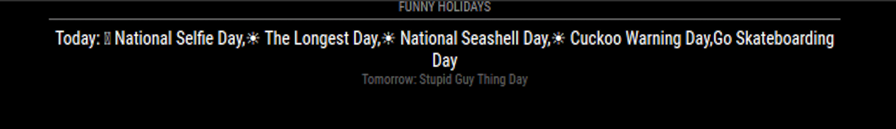

# Module: MMM-CalendarTodayTomorrow

This calendar module functions the same as the default calendar app, but it only displays Today and Tomorrows events.

This module displays events from a public .ical calendar. It can combine multiple calendars.

## Screenshot

## Installation

1. Navigate to the `MagicMirror/modules` directory.
2. Execute `git clone https://github.com/qunu/MMM-CalendarTodayTomorrow.git`
3. Configure the module as per below
4. Restart MagicMirror

For configuration options, please check the [MagicMirror² documentation](https://docs.magicmirror.builders/modules/calendar.html).

**NOTE: The default for config `maximumNumberOfDays` has been set to 2**
